## 1 系统及应用 文件管理

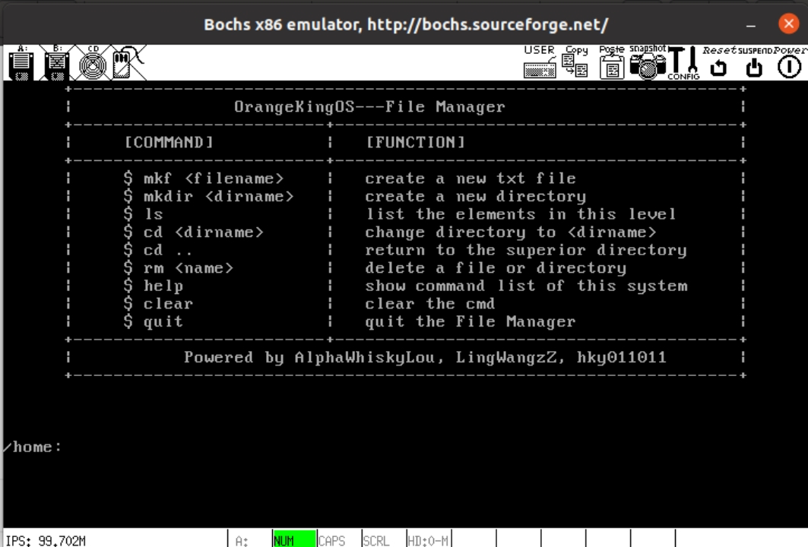

### 1.1 创建文件

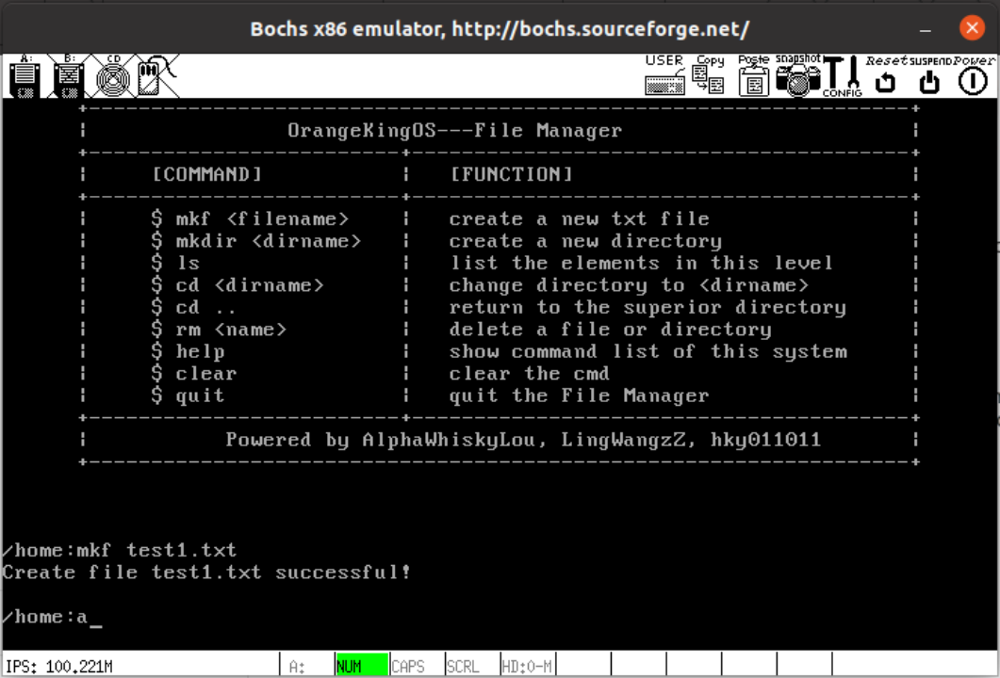

### 1.2 创建目录

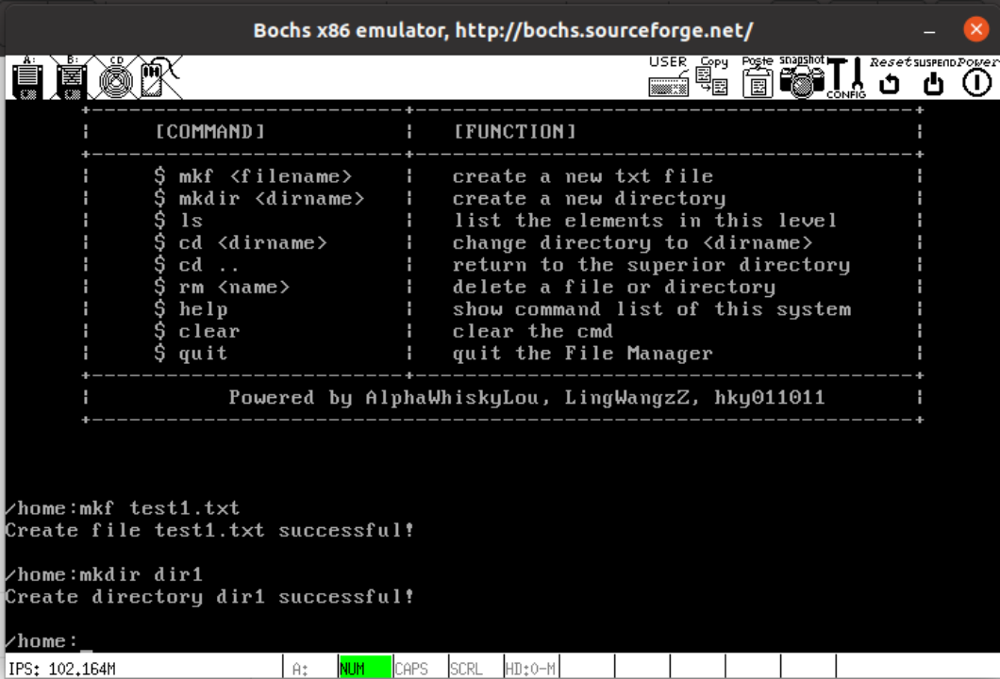

### 1.3 查看文件

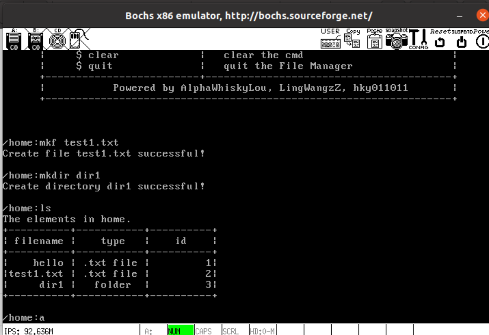

### 1.4 打开其它目录

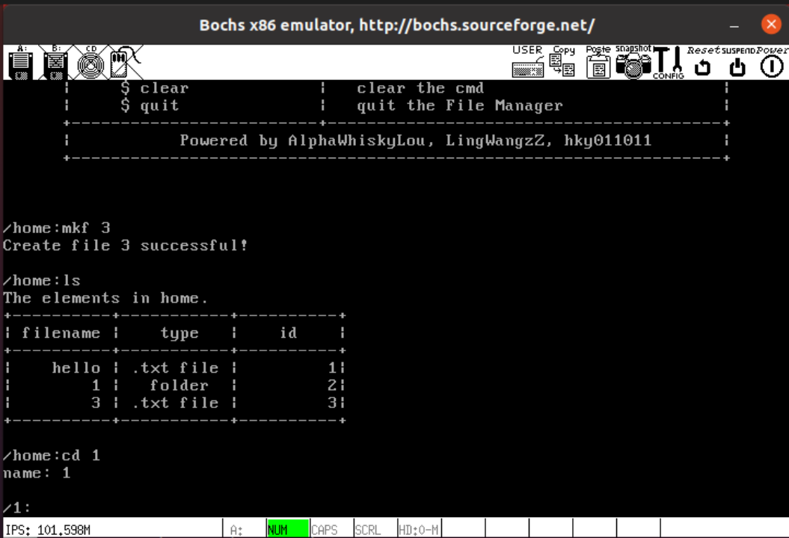

### 1.5 返回上级目录

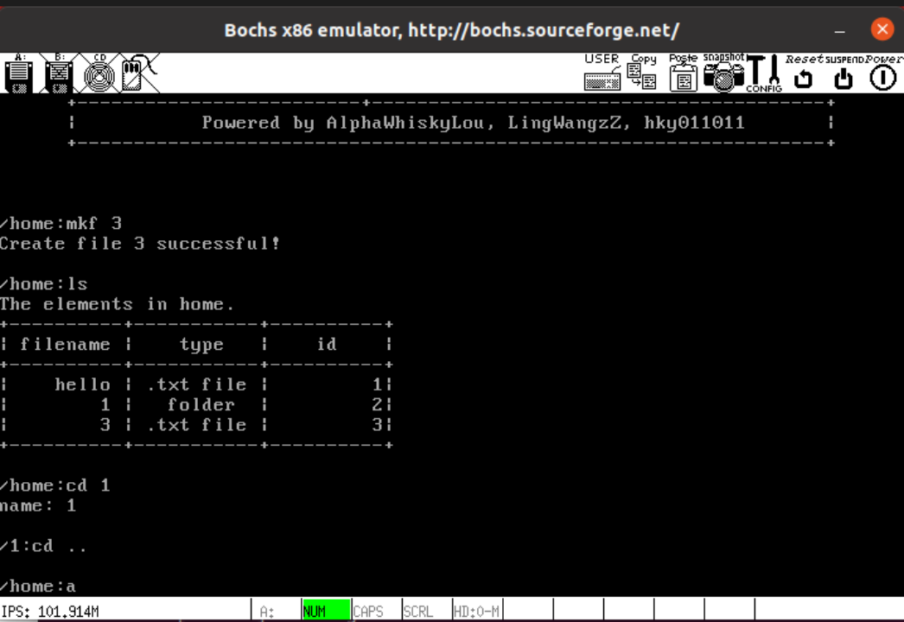

### 1.6 删除文件和目录

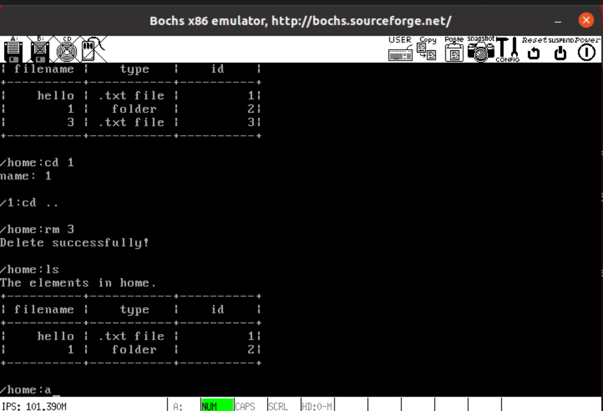

### 1.7 主要函数

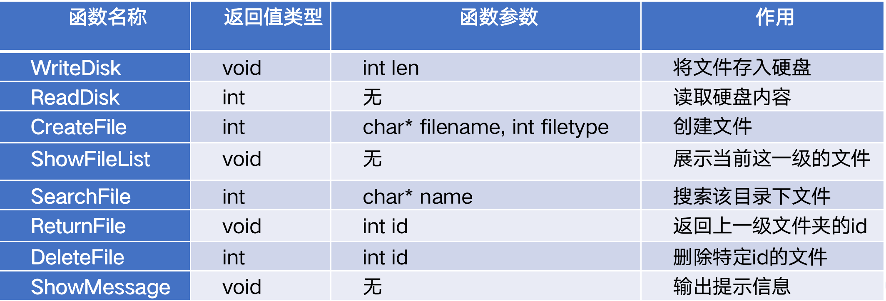

## 2 用户级应用 游戏2048

### 2.1 主界面

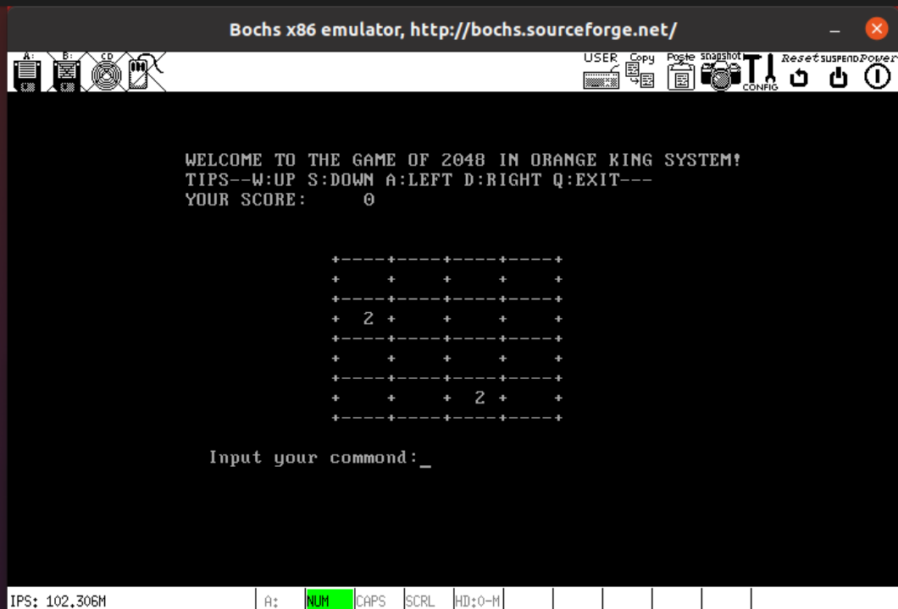

### 1.2 游戏过程

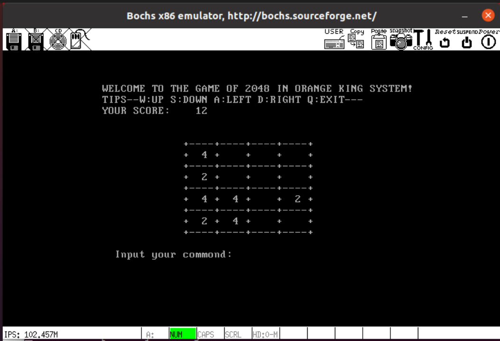

### 1.3 主要函数

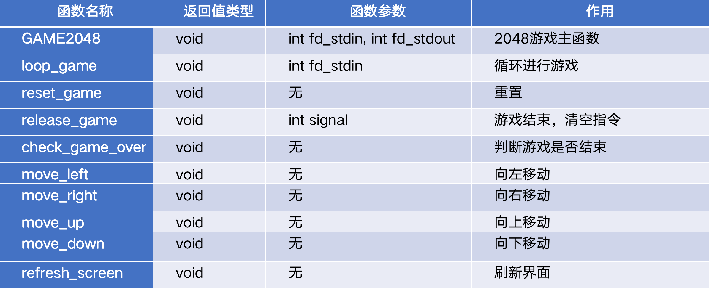

